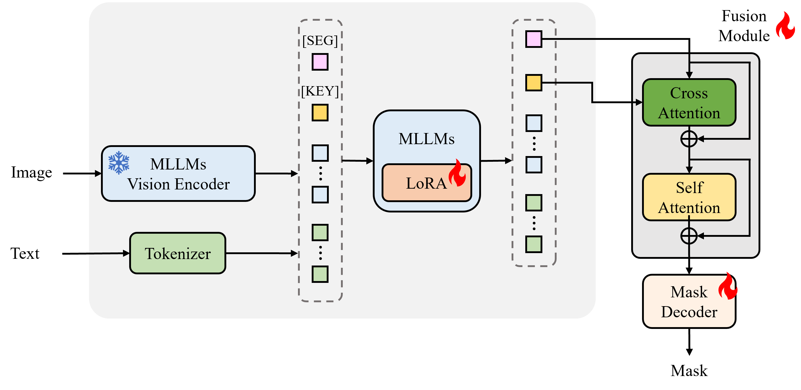

<!-- [](http://103.170.5.190:7860/)
[](https://openxlab.org.cn/apps/detail/openxlab-app/LISA) -->

# KeySeg

<font size=7><div align='center'><b>KeySeg</b>: <b>Key</b>word-Conditioned Image <b>Seg</b>mentation  model</div></font>

<p align="center">  </p>

## News
- [x] GitHub repo is created.

## Abstract
The advancement of Multimodal Large Language Models (MLLMs) has opened new possibilities for reasoning-based image segmentation by jointly processing visual and linguistic information. However, existing approaches often suffer from semantic misalignment between language interpretation and visual segmentation due to the lack of a structural connection between query understanding and segmentation execution. To address this issue, we propose KeySeg (Keyword-Conditioned Image Segmentation), a novel architecture that explicitly encodes and integrates inferred query conditions into the segmentation process. KeySeg embeds the core concepts extracted from multimodal input into a dedicated [KEY] token, which is then fused with a [SEG] token through a cross-attention-based fusion module. This design enables the model to reflect query conditions explicitly and precisely in the segmentation criteria. Additionally, we introduce a keyword alignment loss that guides the [KEY] token to align closely with the semantic core of the input query, thereby enhancing the accuracy of condition interpretation. By separating the roles of condition reasoning and segmentation instruction, and making their interaction explicit, KeySeg achieves both expressive capacity and interpretative stability, even under complex language conditions. 


## Installation
```
pip install -r requirements_keyseg.txt
pip install flash-attn --no-build-isolation
```

## Dataset & Pretrained wieghts
1. Referring segmentation datasets: [refCOCO](https://web.archive.org/web/20220413011718/https://bvisionweb1.cs.unc.edu/licheng/referit/data/refcoco.zip), [refCOCO+](https://web.archive.org/web/20220413011656/https://bvisionweb1.cs.unc.edu/licheng/referit/data/refcoco+.zip), [refCOCOg](https://web.archive.org/web/20220413012904/https://bvisionweb1.cs.unc.edu/licheng/referit/data/refcocog.zip)

2. Reasoning segmentation dataset: [ReasonSeg](https://github.com/dvlab-research/LISA#dataset)

3. Reason_Seg_Key dataset
- Create an ```explanatory_key``` folder inside ```ReasonSeg```
- Move ```keyword_outputs.json``` from ```reason_seg_key``` folder in this repository to ```explanatory_key```

4. SAM ViT-H weights: Download SAM ViT-H pre-trained weights from the [link](https://dl.fbaipublicfiles.com/segment_anything/sam_vit_h_4b8939.pth).

Download them from the above links, and organize them as follows.

```
├── dataset
│   ├──sam_vit_h_4b8939.pth
│   ├── reason_seg
│   │   └── ReasonSeg
│   │       ├── train
│   │       ├── val
│   │       ├── explanatory
│   │       └── explanatory_key
│   │               └── keyword_outputs.json
│   ├── refer_seg
│   │   ├── images
│   │   |   └── mscoco
│   │   |       └── images
│   │   |           └── train2014
│   │   ├── refcoco
│   │   ├── refcoco+
│   │   └── refcocog
```

## Training
```
sh finetune.sh
```

## Validation
```
sh test.sh
```