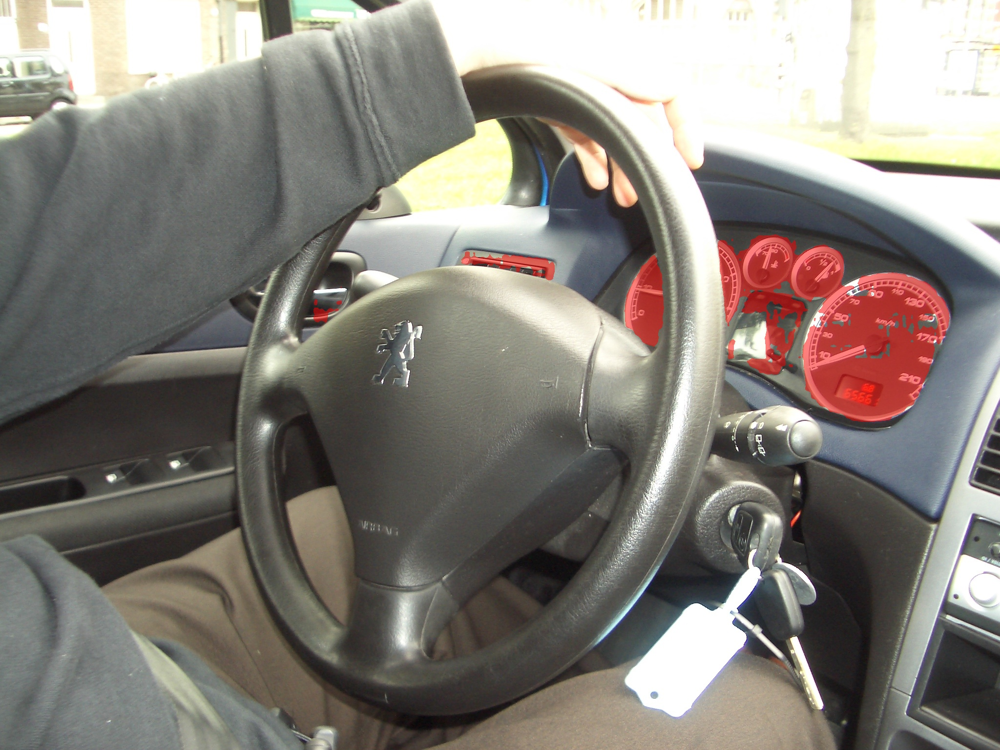

<!-- [](http://103.170.5.190:7860/)
[](https://openxlab.org.cn/apps/detail/openxlab-app/LISA) -->

# KeySeg

<font size=7><div align='center'><b>KeySeg</b>: <b>Key</b>word-Conditioned Image <b>Seg</b>mentation  model</div></font>

<p align="center">  </p>

## News
- [x] GitHub repo is created.

## Abstract
The advancement of Multimodal Large Language Models (MLLMs) has opened new possibilities for reasoning-based image segmentation by jointly processing visual and linguistic information. However, existing approaches often suffer from semantic misalignment between language interpretation and visual segmentation due to the lack of a structural connection between query understanding and segmentation execution. To address this issue, we propose KeySeg (Keyword-Conditioned Image Segmentation), a novel architecture that explicitly encodes and integrates inferred query conditions into the segmentation process. KeySeg embeds the core concepts extracted from multimodal input into a dedicated [KEY] token, which is then fused with a [SEG] token through a cross-attention-based fusion module. This design enables the model to reflect query conditions explicitly and precisely in the segmentation criteria. Additionally, we introduce a keyword alignment loss that guides the [KEY] token to align closely with the semantic core of the input query, thereby enhancing the accuracy of condition interpretation. By separating the roles of condition reasoning and segmentation instruction, and making their interaction explicit, KeySeg achieves both expressive capacity and interpretative stability, even under complex language conditions. 


<!-- ## Installation
```
pip install -r requirements.txt
pip install flash-attn --no-build-isolation
```

## Training
### Training Data Preparation
The training data consists of 4 types of data:

1. Semantic segmentation datasets: [ADE20K](http://data.csail.mit.edu/places/ADEchallenge/ADEChallengeData2016.zip), [COCO-Stuff](http://calvin.inf.ed.ac.uk/wp-content/uploads/data/cocostuffdataset/stuffthingmaps_trainval2017.zip), [Mapillary](https://www.mapillary.com/dataset/vistas), [PACO-LVIS](https://github.com/facebookresearch/paco/tree/main#dataset-setup), [PASCAL-Part](https://github.com/facebookresearch/VLPart/tree/main/datasets#pascal-part), [COCO Images](http://images.cocodataset.org/zips/train2017.zip)

    Note: For COCO-Stuff, we use the annotation file stuffthingmaps_trainval2017.zip. We only use the PACO-LVIS part in PACO. COCO Images should be put into the `dataset/coco/` directory.

3. Referring segmentation datasets: [refCOCO](https://web.archive.org/web/20220413011718/https://bvisionweb1.cs.unc.edu/licheng/referit/data/refcoco.zip), [refCOCO+](https://web.archive.org/web/20220413011656/https://bvisionweb1.cs.unc.edu/licheng/referit/data/refcoco+.zip), [refCOCOg](https://web.archive.org/web/20220413012904/https://bvisionweb1.cs.unc.edu/licheng/referit/data/refcocog.zip), [refCLEF](https://web.archive.org/web/20220413011817/https://bvisionweb1.cs.unc.edu/licheng/referit/data/refclef.zip) ([saiapr_tc-12](https://web.archive.org/web/20220515000000/http://bvisionweb1.cs.unc.edu/licheng/referit/data/images/saiapr_tc-12.zip)) 

    Note: the original links of refCOCO series data are down, and we update them with new ones. If the download speed is super slow or unstable, we also provide a [OneDrive link](https://mycuhk-my.sharepoint.com/:f:/g/personal/1155154502_link_cuhk_edu_hk/Em5yELVBvfREodKC94nOFLoBLro_LPxsOxNV44PHRWgLcA?e=zQPjsc) to download. **You must also follow the rules that the original datasets require.**

4. Visual Question Answering dataset: [LLaVA-Instruct-150k](https://huggingface.co/datasets/liuhaotian/LLaVA-Instruct-150K/blob/main/llava_instruct_150k.json)

5. Reasoning segmentation dataset: [ReasonSeg](https://github.com/dvlab-research/LISA#dataset)

Download them from the above links, and organize them as follows.

```
├── dataset
│   ├── ade20k
│   │   ├── annotations
│   │   └── images
│   ├── coco
│   │   └── train2017
│   │       ├── 000000000009.jpg
│   │       └── ...
│   ├── cocostuff
│   │   └── train2017
│   │       ├── 000000000009.png
│   │       └── ...
│   ├── llava_dataset
│   │   └── llava_instruct_150k.json
│   ├── mapillary
│   │   ├── config_v2.0.json
│   │   ├── testing
│   │   ├── training
│   │   └── validation
│   ├── reason_seg
│   │   └── ReasonSeg
│   │       ├── train
│   │       ├── val
│   │       └── explanatory
│   ├── refer_seg
│   │   ├── images
│   │   |   ├── saiapr_tc-12 
│   │   |   └── mscoco
│   │   |       └── images
│   │   |           └── train2014
│   │   ├── refclef
│   │   ├── refcoco
│   │   ├── refcoco+
│   │   └── refcocog
│   └── vlpart
│       ├── paco
│       │   └── annotations
│       └── pascal_part
│           ├── train.json
│           └── VOCdevkit
```

### Pre-trained weights

#### LLaVA
To train LISA-7B or 13B, you need to follow the [instruction](https://github.com/haotian-liu/LLaVA/blob/main/docs/MODEL_ZOO.md) to merge the LLaVA delta weights. Typically, we use the final weights `LLaVA-Lightning-7B-v1-1` and `LLaVA-13B-v1-1` merged from `liuhaotian/LLaVA-Lightning-7B-delta-v1-1` and `liuhaotian/LLaVA-13b-delta-v1-1`, respectively. For Llama2, we can directly use the LLaVA full weights `liuhaotian/llava-llama-2-13b-chat-lightning-preview`.

#### SAM ViT-H weights
Download SAM ViT-H pre-trained weights from the [link](https://dl.fbaipublicfiles.com/segment_anything/sam_vit_h_4b8939.pth).

### Training
```
deepspeed --master_port=24999 train_ds.py \
  --version="PATH_TO_LLaVA" \
  --dataset_dir='./dataset' \
  --vision_pretrained="PATH_TO_SAM" \
  --dataset="sem_seg||refer_seg||vqa||reason_seg" \
  --sample_rates="9,3,3,1" \
  --exp_name="lisa-7b"
```
When training is finished, to get the full model weight:
```
cd ./runs/lisa-7b/ckpt_model && python zero_to_fp32.py . ../pytorch_model.bin
```

### Merge LoRA Weight
Merge the LoRA weights of `pytorch_model.bin`, save the resulting model into your desired path in the Hugging Face format:
```
CUDA_VISIBLE_DEVICES="" python merge_lora_weights_and_save_hf_model.py \
  --version="PATH_TO_LLaVA" \
  --weight="PATH_TO_pytorch_model.bin" \
  --save_path="PATH_TO_SAVED_MODEL"
```

For example:
```
CUDA_VISIBLE_DEVICES="" python3 merge_lora_weights_and_save_hf_model.py \
  --version="./LLaVA/LLaVA-Lightning-7B-v1-1" \
  --weight="lisa-7b/pytorch_model.bin" \
  --save_path="./LISA-7B"
```

### Validation
```
deepspeed --master_port=24999 train_ds.py \
  --version="PATH_TO_LISA_HF_Model_Directory" \
  --dataset_dir='./dataset' \
  --vision_pretrained="PATH_TO_SAM" \
  --exp_name="lisa-7b" \
  --eval_only
```

Note: the `v1` model is trained using both `train+val` sets, so please use the `v0` model to reproduce the validation results. (To use the `v0` models, please first checkout to the legacy version repo with `git checkout 0e26916`.)

 
## Inference 

To chat with [LISA-13B-llama2-v1](https://huggingface.co/xinlai/LISA-13B-llama2-v1) or [LISA-13B-llama2-v1-explanatory](https://huggingface.co/xinlai/LISA-13B-llama2-v1-explanatory):
(Note that `chat.py` currently does not support `v0` models (i.e., `LISA-13B-llama2-v0` and `LISA-13B-llama2-v0-explanatory`), if you want to use the `v0` models, please first checkout to the legacy version repo `git checkout 0e26916`.)
```
CUDA_VISIBLE_DEVICES=0 python chat.py --version='xinlai/LISA-13B-llama2-v1'
CUDA_VISIBLE_DEVICES=0 python chat.py --version='xinlai/LISA-13B-llama2-v1-explanatory'
```
To use `bf16` or `fp16` data type for inference:
```
CUDA_VISIBLE_DEVICES=0 python chat.py --version='xinlai/LISA-13B-llama2-v1' --precision='bf16'
```
To use `8bit` or `4bit` data type for inference (this enables running 13B model on a single 24G or 12G GPU at some cost of generation quality):
```
CUDA_VISIBLE_DEVICES=0 python chat.py --version='xinlai/LISA-13B-llama2-v1' --precision='fp16' --load_in_8bit
CUDA_VISIBLE_DEVICES=0 python chat.py --version='xinlai/LISA-13B-llama2-v1' --precision='fp16' --load_in_4bit
```
Hint: for 13B model, 16-bit inference consumes 30G VRAM with a single GPU, 8-bit inference consumes 16G, and 4-bit inference consumes 9G.

After that, input the text prompt and then the image path. For example，
```
- Please input your prompt: Where can the driver see the car speed in this image? Please output segmentation mask.
- Please input the image path: imgs/example1.jpg

- Please input your prompt: Can you segment the food that tastes spicy and hot?
- Please input the image path: imgs/example2.jpg
```
The results should be like:
<p align="center">     </p>

## Deployment
```
CUDA_VISIBLE_DEVICES=0 python app.py --version='xinlai/LISA-13B-llama2-v1 --load_in_4bit'
CUDA_VISIBLE_DEVICES=0 python app.py --version='xinlai/LISA-13B-llama2-v1-explanatory --load_in_4bit'
```
By default, we use 4-bit quantization. Feel free to delete the `--load_in_4bit` argument for 16-bit inference or replace it with `--load_in_8bit` argument for 8-bit inference.


## Dataset
In ReasonSeg, we have collected 1218 images (239 train, 200 val, and 779 test). The training and validation sets can be download from <a href="https://drive.google.com/drive/folders/125mewyg5Ao6tZ3ZdJ-1-E3n04LGVELqy?usp=sharing">**this link**</a>. 

Each image is provided with an annotation JSON file:
```
image_1.jpg, image_1.json
image_2.jpg, image_2.json
...
image_n.jpg, image_n.json
```
Important keys contained in JSON files:
```
- "text": text instructions.
- "is_sentence": whether the text instructions are long sentences.
- "shapes": target polygons.
```

The elements of the "shapes" exhibit two categories, namely **"target"** and **"ignore"**. The former category is indispensable for evaluation, while the latter category denotes the ambiguous region and hence disregarded during the evaluation process. 

We provide a <a href="https://github.com/dvlab-research/LISA/blob/main/utils/data_processing.py">**script**</a> that demonstrates how to process the annotations:
```
python3 utils/data_processing.py
```

Besides, we leveraged GPT-3.5 for rephrasing instructions, so images in the training set may have **more than one instructions (but fewer than six)** in the "text" field. During training, users may randomly select one as the text query to obtain a better model.


## Citation 
If you find this project useful in your research, please consider citing:

```
@article{lai2023lisa,
  title={LISA: Reasoning Segmentation via Large Language Model},
  author={Lai, Xin and Tian, Zhuotao and Chen, Yukang and Li, Yanwei and Yuan, Yuhui and Liu, Shu and Jia, Jiaya},
  journal={arXiv preprint arXiv:2308.00692},
  year={2023}
}
@article{yang2023improved,
  title={An Improved Baseline for Reasoning Segmentation with Large Language Model},
  author={Yang, Senqiao and Qu, Tianyuan and Lai, Xin and Tian, Zhuotao and Peng, Bohao and Liu, Shu and Jia, Jiaya},
  journal={arXiv preprint arXiv:2312.17240},
  year={2023}
}
```

## Acknowledgement
-  This work is built upon the [LLaVA](https://github.com/haotian-liu/LLaVA) and [SAM](https://github.com/facebookresearch/segment-anything).  -->
